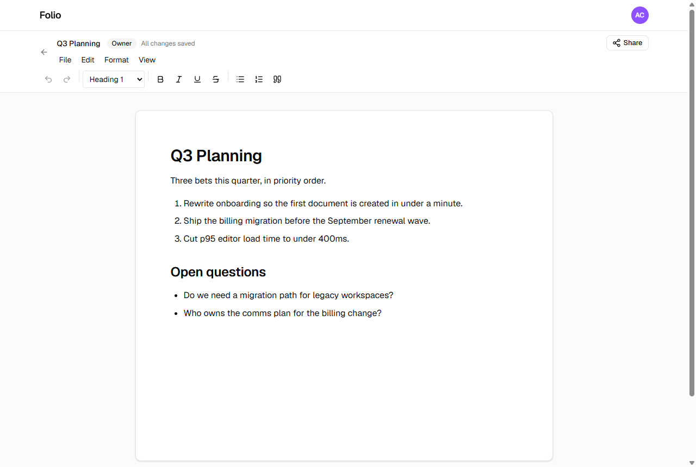
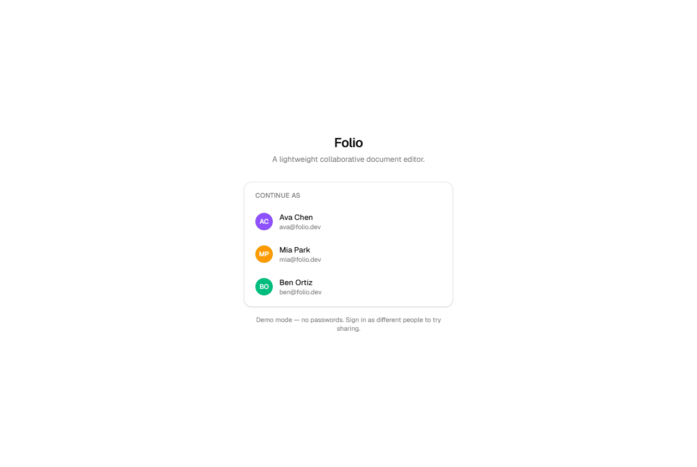
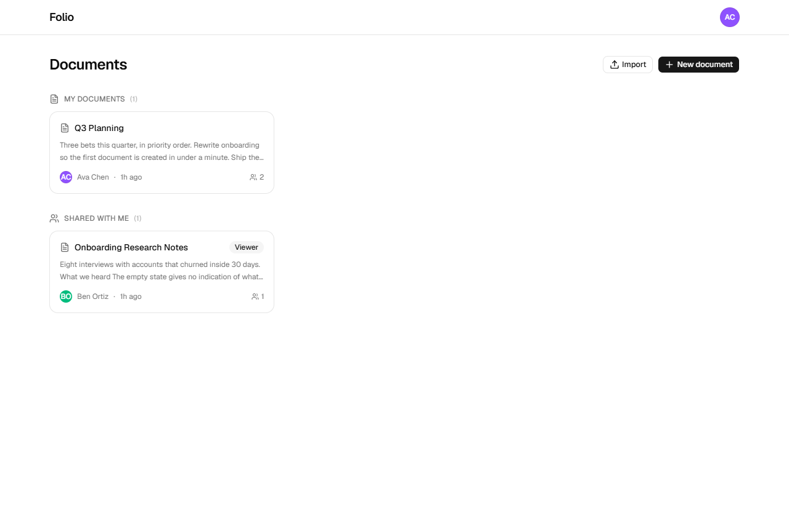
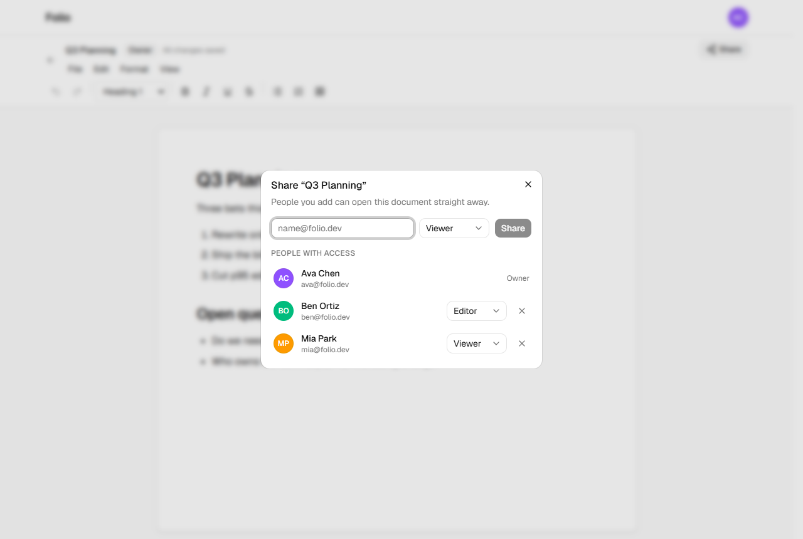
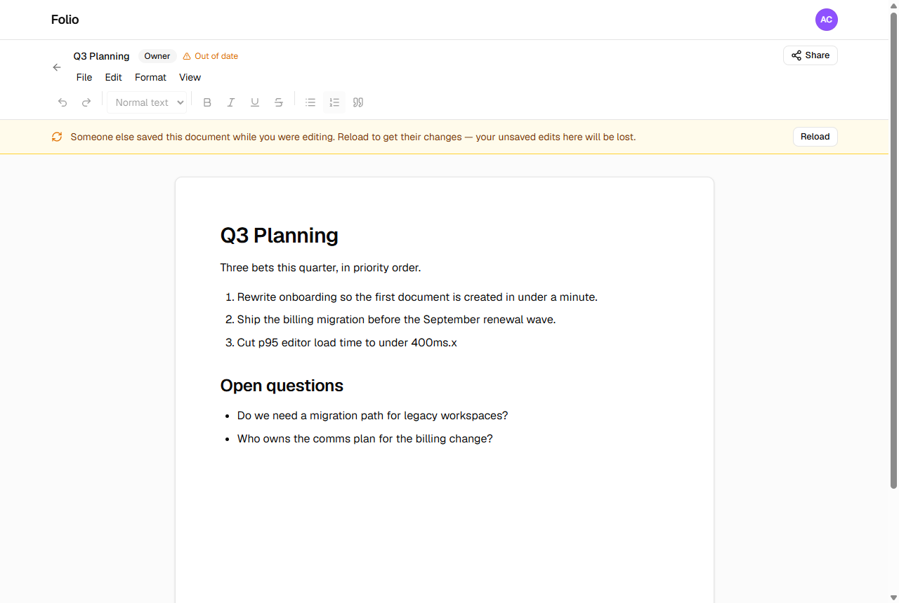
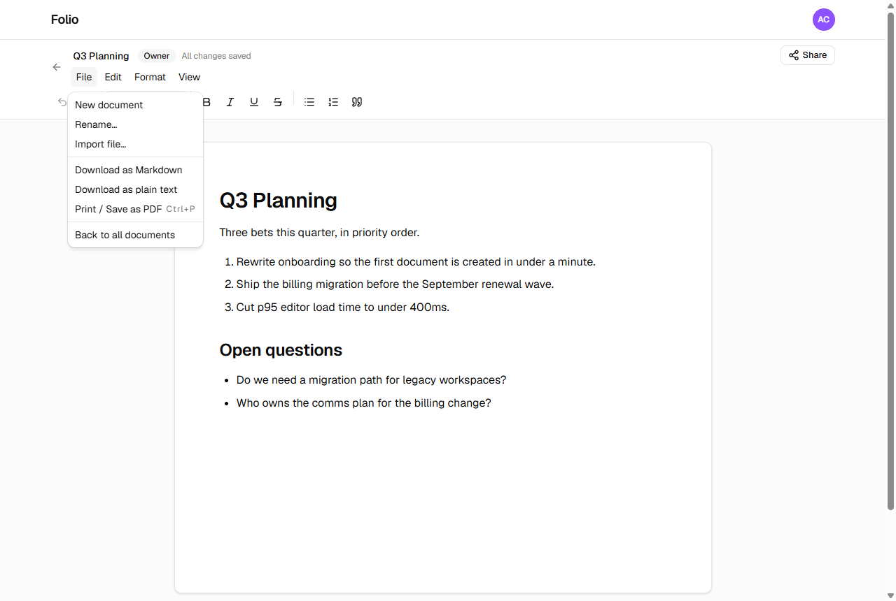
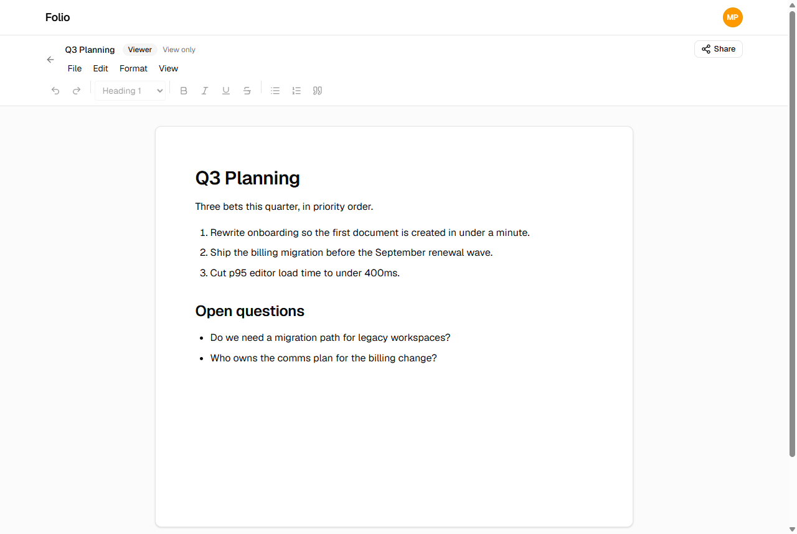

# Folio

A lightweight collaborative document editor — create, format, import, attach, share.

**Live app: <https://folio-omega-cyan.vercel.app>** — no credentials needed; sign-in is a picker
of demo accounts.



## What it does

- **Documents** — create, rename, edit, autosave, reopen. Formatting survives a refresh.
- **Rich text** — bold, italic, underline, strikethrough, headings, bulleted and numbered lists,
  quotes, undo/redo.
- **Concurrent editing** — a save from a stale version is rejected rather than silently
  overwriting someone else's work.
- **Import** — `.docx`, `.md` and `.txt` become new documents with their formatting.
- **Export** — Markdown, plain text, or print-to-PDF.
- **Attachments** — stored privately; every download re-runs the document's access check.
- **Sharing** — grant access by email as Viewer or Editor, change roles, revoke.

Further reading: [ARCHITECTURE.md](ARCHITECTURE.md) for the design decisions and what was left
out, [AI_WORKFLOW.md](AI_WORKFLOW.md) for how AI was used and how the result was verified.

## Stack

| Layer           | Choice                                          |
| --------------- | ----------------------------------------------- |
| Framework       | Next.js 16 (App Router), React 19, TypeScript    |
| Styling         | Tailwind CSS 4, shadcn/ui                        |
| Database        | Postgres + Prisma (local via Docker Compose)     |
| Tests           | Vitest                                           |
| Package manager | pnpm                                             |

## Getting started

### Prerequisites

- Node.js 20 or newer
- pnpm 10 or newer (`corepack enable pnpm`)
- Docker — optional, used to run Postgres locally

### 1. Install dependencies

```bash
pnpm install
```

### 2. Configure environment

```bash
cp .env.example .env
```

The defaults match the bundled Docker Compose service, so no edits are needed for local
development. A single `.env` is used because both Next.js and the Prisma CLI read it.

### 3. Start Postgres

```bash
docker compose up -d
```

Postgres listens on **port 5433**, chosen so it never collides with a Postgres already running on
5432.

**No Docker?** Point `DATABASE_URL` at any Postgres instance instead — a free
[Neon](https://neon.tech) branch works — and skip this step.

### 4. Create the schema and seed demo data

```bash
pnpm db:migrate
pnpm db:seed
```

Seeding is re-runnable: it clears documents and users first, so running it twice does not
produce duplicates.

### 5. Run the app

```bash
pnpm dev
```

The app is served at <http://localhost:3000>.

## Scripts

| Command           | What it does                     |
| ----------------- | -------------------------------- |
| `pnpm dev`        | Start the development server     |
| `pnpm build`      | Production build                 |
| `pnpm start`      | Serve the production build       |
| `pnpm test`       | Run the test suite once          |
| `pnpm test:watch` | Run tests in watch mode          |
| `pnpm lint`       | ESLint                           |
| `pnpm typecheck`  | TypeScript, no emit              |
| `pnpm format`     | Format source files with Prettier |
| `pnpm db:migrate` | Create and apply a migration     |
| `pnpm db:deploy`  | Apply migrations (production)    |
| `pnpm db:seed`    | Load demo users and documents    |
| `pnpm db:studio`  | Browse the database in Prisma Studio |
| `pnpm db:reset`   | Drop, re-migrate and re-seed     |

## Environment variables

| Variable                | Required | Purpose                                                       |
| ----------------------- | -------- | ------------------------------------------------------------- |
| `DATABASE_URL`          | Yes      | Postgres connection string                                     |
| `DIRECT_URL`            | Yes      | Unpooled connection, used by migrations only                   |
| `SESSION_SECRET`        | Yes      | Signs session cookies                                          |
| `BLOB_READ_WRITE_TOKEN` | No       | Blob storage token for attachments; empty disables uploads     |

## Project structure

```
app/          Next.js routes (App Router) and API route handlers
components/   React components; components/ui holds shadcn/ui primitives
lib/          Domain logic, utilities, and their colocated tests
  authz/        the permission model — start here
  documents/    content shape, validation, conversion
  attachments/  limits, validation, blob storage
  sharing/      share request rules
prisma/       Schema, migrations, and the demo-data seed
docs/         Screenshots of the live deployment
```

`lib/authz/policy.ts` is the most load-bearing file in the project: every document read and write
passes through it. [ARCHITECTURE.md](ARCHITECTURE.md) explains why that shape was chosen.

## Sharing

Every document has one **owner**. Anyone else reaches it through a share carrying a role:

| Role       | Read | Edit | Manage sharing | Delete |
| ---------- | ---- | ---- | -------------- | ------ |
| **Owner**  | ✅    | ✅    | ✅              | ✅      |
| **Editor** | ✅    | ✅    | ❌              | ❌      |
| **Viewer** | ✅    | ❌    | ❌              | ❌      |

Open a document and press **Share** to grant access by email, change someone's role, or remove
them. Only the owner sees those controls — an editor can change a document's contents but not who
else can reach it.

Rules are enforced on the server for every request, not just hidden in the interface. Two details
worth knowing:

- Someone with **no** access gets **404**, not 403, so the API cannot be used to discover which
  document IDs exist. Someone who can already see the document gets an honest 403.
- **Revoking is immediate.** Access is resolved from the share rows on every request, so removing
  a share closes the document, its attachments and its exports at the same moment.

## Importing and exporting

**Import** turns a file into a new document, from the dashboard or `File → Import file…`.

| Accepted    | Notes                                                              |
| ----------- | ------------------------------------------------------------------ |
| `.docx`     | Headings, bold, italic and lists are preserved. Images are dropped. |
| `.md`       | Parsed as Markdown, not stored as literal text.                     |
| `.txt`      | One paragraph per line.                                             |

Files must be **2 MB or smaller**. Type is checked against the file's actual bytes rather than
its name, so a renamed binary is rejected.

**Export** is under `File`: Markdown, plain text, or `Print / Save as PDF`, which uses the
browser's own print dialog with a print stylesheet.

## Attachments

Files can be attached to a document from the panel below the page. Attachments are stored
**privately** and have no public URL: every download goes back through the app and re-runs the
document's access check, so revoking someone's access closes the attachments with it.

Accepted: images (PNG, JPEG, GIF, WebP), PDF, Office files (`.docx`, `.xlsx`, `.pptx`), `.txt`,
`.md`, `.csv`, `.json` and `.zip` — up to **5 MB each**, **10 per document**. The list is an
allowlist, so anything not named is refused; HTML and SVG are excluded deliberately because both
can carry scripts.

Attachments need `BLOB_READ_WRITE_TOKEN`. Without it the rest of the app runs normally and the
upload control explains that storage is unconfigured, so local setup is never blocked by it.

## Screenshots

| | |
| --- | --- |
|  |  |
| Demo account picker | Owned and shared documents |
|  |  |
| Granting and changing access | A stale save rejected, not silently overwritten |
|  |  |
| Every menu item does something | A viewer gets a genuinely read-only editor |

## Demo accounts

Seeded by `pnpm db:seed`. Sign-in is a picker, so no passwords are needed.

| User      | Email           | Owns                      | Also has access to                   |
| --------- | --------------- | ------------------------- | ------------------------------------ |
| Ava Chen  | `ava@folio.dev` | Q3 Planning               | Onboarding Research Notes (viewer)   |
| Ben Ortiz | `ben@folio.dev` | Onboarding Research Notes | Q3 Planning (editor)                 |
| Mia Park  | `mia@folio.dev` | Release Checklist         | Q3 Planning (viewer)                 |

The seed deliberately covers all three states — owned, shared as editor, shared as viewer — so
the access rules are visible without setting anything up by hand.
